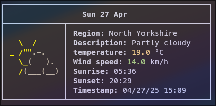
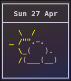
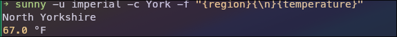

# Sunny
Sunny is a weather fetching CLI based on [thundery](https://github.com/loefey/thundery) and [rainy](https://github.com/liveslol/rainy)


## Examples
```Bash
sunny -c York
```



```Bash
sunny -ac York
```



```Bash
sunny -u imperial -c York -f "{region}{\n}{temperature}"
```


